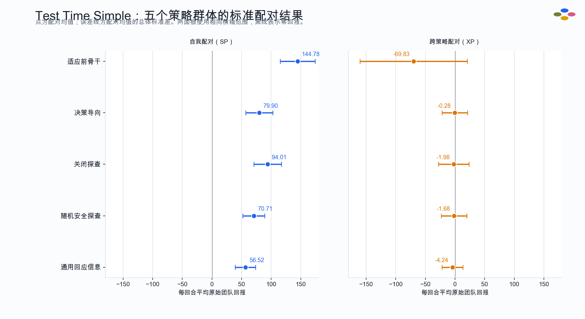
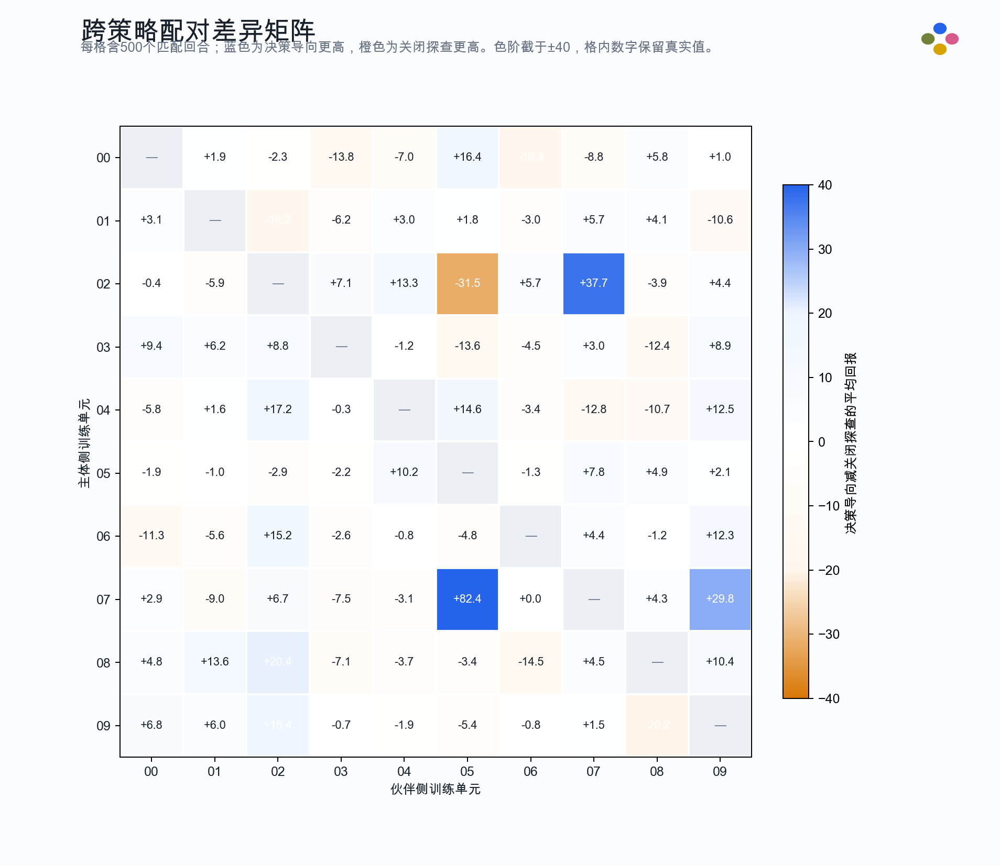
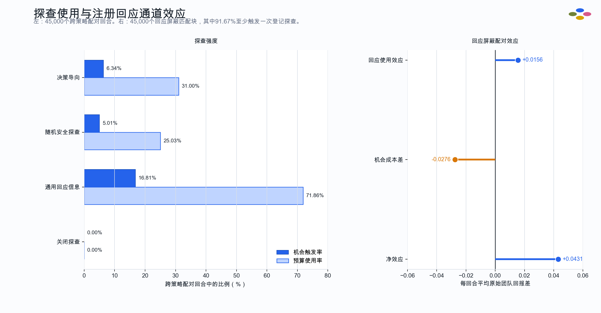

# Path C 家族级伙伴池：Test Time Simple 实验结果

**报告日期：** 2026-07-25

**读数状态：** 探索性结果；结果相关协议修订后运行

**运行标记：** `scientific_readout_allowed: false`

**覆盖范围：** 仅包含已完成最终审计的 Test Time Simple；不包含仍在运行的 Test Time Wide
**最终审计 SHA-256：** `4e5d16c752491023103732f5d90a9bbcd03d6f241a19b03ded4380cf4d296815`

## 技术摘要

家族级伙伴池的 Test Time Simple 完整链已经作为软件和评估工具通过验收：六个目标测试文件
共 79 项测试，0 失败、0 错误、0 跳过；10 个独立训练单元、五个标准配对矩阵、决策导向条件
的回应屏蔽对照和最终审计均已完成。所有下述统计均由远端原始行重新计算，没有直接采用运行器
自报的汇总值。

适应前骨干的跨策略配对（cross-play，XP）平均原始团队回报为 **−69.83**。四个适应条件将
该数值提高到 **−4.24 至 −0.28**，说明适应过程大幅缓解了不同训练单元之间的协作冲突；
与此同时，自我配对（self-play，SP）回报从 **144.78** 降至 **56.52–94.01**，说明这一改善
伴随明显的原有自我协作能力损失。

决策导向条件的 XP 数值最高，为 **−0.28**，但相对关闭探查只提高 **+1.71**。按冻结规则对
10 个训练单元进行 9,999 次节点重采样所得的 95% 区间为 **[−2.81, 7.71]**；区间跨越 0，
且点估计远低于预先登记的 **20 分实际意义门槛**。因此，本次 Simple 结果没有满足项目内部
关于决策导向探查优于关闭探查的主要判据。

回应屏蔽对照中的注册回应使用效应为 **+0.0156**，净效应为 **+0.0431**。这两个点估计都
接近 0，没有显示注册回应通道在当前实现和布局中承担了可测量的增量价值；该对照没有登记
不确定性区间，所以这是一项描述性机制读数，不是对一般回应价值的否定结论。

## 1. 协议与统计单位

每个策略群体由 10 个独立训练单元的最终策略组成。标准矩阵包含：

- 10 个对角 SP 配对：同一训练单元的策略与自身配对；
- 90 个有向非对角 XP 配对：主体侧和伙伴侧来自不同训练单元；
- 每个配对 500 个独立的 400 步回合；
- 每个群体共 100 个配对、50,000 个回合和 20,000,000 个环境步。

本报告以“配对的 500 回合平均回报”为基本统计单位。SP 均值与标准差来自 10 个对角配对，
XP 均值与标准差来自 90 个有向非对角配对；标准差是配对均值的总体标准差，不是把所有回合
当作独立训练重复后得到的回合级标准误。五个群体在对应配对和回合上使用完全相同的环境随机
seed，因而条件间比较保持回合结构匹配。

## 2. 五个标准矩阵的完整结果

| 策略群体 | SP 平均回报 | SP 配对标准差 | XP 平均回报 | XP 配对标准差 | SP − XP |
|---|---:|---:|---:|---:|---:|
| 适应前骨干 | 144.78 | 29.43 | −69.83 | 90.74 | 214.61 |
| 决策导向 | 79.90 | 23.01 | **−0.28** | 21.56 | 80.18 |
| 关闭探查 | **94.01** | 23.16 | −1.98 | 25.81 | 96.00 |
| 随机安全探查 | 70.71 | 18.53 | −1.68 | 21.70 | 72.39 |
| 通用回应信息 | 56.52 | 17.20 | −4.24 | 17.66 | 60.76 |

图 1 的点为配对均值，横向误差线为配对均值的总体标准差；两个面板使用相同横轴范围并保留
零回报线。所有适应条件的 XP 都远高于适应前骨干，但没有一个条件恢复骨干的 SP 水平。
决策导向的 XP 数值最高，关闭探查的 SP 数值最高；这些排序仅为本次探索性运行的描述。

## 3. 决策导向与关闭探查的匹配比较

在 90 个有向 XP 配对中，决策导向减关闭探查的配对差为：

- 平均差：**+1.7071**；
- 9,999 次训练单元节点重采样 95% 区间：**[−2.8061, 7.7083]**；
- 固定重采样 seed：`3538961710`；
- 正差 44 个、负差 45 个、精确相等 1 个；
- 预先登记的实际意义门槛：**20 分**。

图 2 的行是主体侧训练单元，列是伙伴侧训练单元；对角线不属于 XP，标为不适用。蓝色表示
决策导向更高，橙色表示关闭探查更高。色阶为便于辨认截在 ±40，但格内数字保留真实值。矩阵
同时存在较大的正差和负差，整体正负数量几乎相等，因此 +1.71 的总体均值不能解释为稳定的
跨训练单元优势。

## 4. 探查行为与回应通道机制读数

### 4.1 跨策略配对中的探查使用

| 条件 | 实际探查数 | 安全候选机会数 | 机会触发率 | 最大预算合计 | 预算使用率 | 正确交付 | 错误交付 |
|---|---:|---:|---:|---:|---:|---:|---:|
| 决策导向 | 558,087 | 8,804,324 | 6.34% | 1,800,000 | 31.00% | 43,757 | 44,381 |
| 关闭探查 | 0 | 9,000,000 | 0.00% | 1,800,000 | 0.00% | 45,376 | 49,841 |
| 随机安全探查 | 450,458 | 9,000,000 | 5.01% | 1,800,000 | 25.03% | 39,091 | 42,862 |
| 通用回应信息 | 1,293,431 | 7,693,930 | 16.81% | 1,800,000 | 71.86% | 30,106 | 39,641 |

关闭探查条件在全部标准评估行中的探查数均为 0。决策导向的机会触发率略高于随机安全探查，
但二者 XP 回报只相差 1.40 分；通用回应信息使用了明显更多预算，同时获得四个适应条件中
最低的 XP 回报。这里的计数说明控制器实际做了什么，不单独识别探查的因果效果。

### 4.2 回应屏蔽部署对照

决策导向群体的 90 个 XP 配对另执行 45,000 个匹配回合块。每个回合块比较：

- `A1`：执行最佳回应屏蔽参照动作；
- `A2-mask`：执行同一个登记探查动作，但屏蔽该次注册回应；
- `A2-use`：执行同一个登记探查动作，并正常使用注册回应。

其中 41,251 个回合块至少触发一次登记探查，占 **91.67%**。三项平均回报效应为：

| 效应 | 定义 | 每回合平均原始团队回报差 |
|---|---|---:|
| 回应使用效应 | `A2-use − A2-mask` | +0.0156 |
| 机会成本差 | `A1 − A2-mask` | −0.0276 |
| 净效应 | `A2-use − A1` | +0.0431 |

图 3 左侧给出四个适应条件的 XP 机会触发率和预算使用率；右侧以零为中心给出三项回应屏蔽
效应。原始行独立重算满足
`净效应 = 回应使用效应 − 机会成本差`，数值残差为 **0**。对照共生成 135,000 条分支记录，
执行 54,000,000 个环境步；利用共同前缀折算的独立环境步为 49,018,453。三个效应的绝对值
都不到 0.05 分，当前数据没有显示注册回应通道提供了实质性的增量回报。

## 5. 与 OvercookedV2 论文基线的描述性比较

[OvercookedV2 原论文](https://arxiv.org/html/2503.17821) Table 2 在 Test Time Simple 上报告
如下结果。表中数值沿用论文的 SP、XP 和跨训练运行离散度口径。

| 官方方法 | SP | XP | SP − XP |
|---|---:|---:|---:|
| Self-Play | 145 ± 22 | −81 ± 99 | 220 ± 26 |
| State-Augmented | 161 ± 18 | −55 ± 103 | 230 ± 53 |
| Other-Play | 121 ± 37 | −3 ± 51 | 131 ± 50 |
| Fictitious Co-Play | 35 ± 44 | 6 ± 29 | 25 ± 47 |

当前适应前骨干的 SP 为 144.78，与论文 Self-Play 的 SP 量级一致；其 XP 为 −69.83，也处在
论文 Self-Play 高跨运行方差所覆盖的范围。决策导向的 XP 为 −0.28，描述上接近 Other-Play
的 −3，低于 Fictitious Co-Play 的 6。由于当前运行与官方结果不是同一批训练单元、没有联合
统计检验，并且本次运行在观察上游能力结果后修改过能力准入规则，因此不能声称统计优于、
等价于或不劣于任何官方方法。

## 6. 预算与完整性核验

### 6.1 实际回读预算

| 阶段 | 环境步 |
|---|---:|
| 50 个官方上游训练任务 | 1,498,480,640 |
| 10 次预拟合 | 10,000,000 |
| 10 次训练校准 | 2,000,000 |
| 40 个条件适应训练 | 400,000,000 |
| 40 次部署校准 | 8,000,000 |
| 五个标准矩阵 | 100,000,000 |
| 回应屏蔽对照 | 54,000,000 |
| **总计** | **2,072,480,640** |

五个标准矩阵合计 250,000 个评估回合。回应屏蔽对照另有 45,000 个匹配回合块和 135,000 条
分支记录。上游 50 个固定任务中，47 个达到登记的能力阈值，3 个未达到；三个未达标任务分别
为 `outer_unit_04__backbone`、`outer_unit_04__other_play_1` 和
`outer_unit_07__other_play_1`。按照结果相关修订后的规则，全部固定 seed 均被保留，没有替换，
也没有重复训练直到通过。

### 6.2 原始行独立核验

本报告重算并通过以下检查：

- 每个群体恰有 100 个配对，每配对 500 个唯一回合；
- 每个群体恰有 10 个 SP 配对和 90 个有向 XP 配对；
- 五个群体对应配对与回合的环境 seed 完全一致；
- 每个配对均值、10/90 配对总体标准差和 `SP − XP` 与正式审计摘要精确一致；
- 关闭探查条件的探查数始终为 0；
- 所有正确与错误交付计数均非负；
- 9,999 次训练单元节点重采样区间与正式审计摘要精确一致；
- 回应屏蔽三项效应恒等式的重算残差为 0；
- 79 项测试为 0 失败、0 错误、0 跳过。

## 7. 证据位置与哈希

远端项目根目录为
`/apps/users/cxw/Document/CodeSpace/Selfs/CPR_REPO`。下表路径均相对于该目录。

| 证据 | 路径 | SHA-256 |
|---|---|---|
| 最终审计 | `results/path_c_family_pool_formal_standard/test_time_simple/control/formal_audit_summary.json` | `4e5d16c752491023103732f5d90a9bbcd03d6f241a19b03ded4380cf4d296815` |
| 外层训练单元清单 | `results/path_c_family_pool_formal_standard/test_time_simple/control/path_c_outer_units_test_time_simple.json` | `3dfe3cf6664d26af31eea642a00f5cddf4f6db2e548fc9f2a5cf54e174490ff9` |
| 最终目标测试日志 | `.codex_remote_validation/path_c_family_pool_v3_20260724/stale_contract_resume_validation_cuda12/tests.log` | `b26a3d0e0a22c3027224a87374d4477b69df4b3ffd7c941d54de41552249daed` |
| 适应前骨干原始行 | `results/path_c_family_pool_formal_standard/test_time_simple/standard_evaluation/pre_adaptation_backbone/rows.jsonl` | `b68bfe4f8eb26ca04b024a8616c0a185cbe1b860228929cd54027dc59faf064f` |
| 适应前骨干摘要 | `results/path_c_family_pool_formal_standard/test_time_simple/standard_evaluation/pre_adaptation_backbone/summary.json` | `1fb5c4fe0835d25ba4bd2c49497cd6c58b41010373efd086022dc92ec1b6436c` |
| 适应前骨干收据 | `results/path_c_family_pool_formal_standard/test_time_simple/standard_evaluation/pre_adaptation_backbone/evaluation_receipt.json` | `1cc19d3a1280f0bc9b43afb54c027311e3b32e2394be88e7b587ea5d7341fbe1` |
| 决策导向原始行 | `results/path_c_family_pool_formal_standard/test_time_simple/standard_evaluation/decision_focused/rows.jsonl` | `2f8f2d887197e1200612aef706a3597b807c75c21211e102ed28e918bf40faeb` |
| 决策导向摘要 | `results/path_c_family_pool_formal_standard/test_time_simple/standard_evaluation/decision_focused/summary.json` | `04e8d46d2e203544ce1c9b33779ce9c0e7ed1dba345bf67e84b0157cd543834f` |
| 决策导向收据 | `results/path_c_family_pool_formal_standard/test_time_simple/standard_evaluation/decision_focused/evaluation_receipt.json` | `47a86dcc7c0f6d11310b5fd5f426f79ac0d3ff4a725c40b37b30677a4a708c3f` |
| 关闭探查原始行 | `results/path_c_family_pool_formal_standard/test_time_simple/standard_evaluation/no_probe/rows.jsonl` | `b6bc753719bdd91d67c7fa029412d9956aa6ad0bbbf96c27da4a2355aacb736c` |
| 关闭探查摘要 | `results/path_c_family_pool_formal_standard/test_time_simple/standard_evaluation/no_probe/summary.json` | `6bcf9d550ea5bc368d658a8d8de635d30e5d9fcd5e16bb54b8427e3f10a34007` |
| 关闭探查收据 | `results/path_c_family_pool_formal_standard/test_time_simple/standard_evaluation/no_probe/evaluation_receipt.json` | `fb376b0e2a4fc903b2870a745730f23c0abfbc657919d44f4890be1694538cf5` |
| 随机安全探查原始行 | `results/path_c_family_pool_formal_standard/test_time_simple/standard_evaluation/random_safe_probe/rows.jsonl` | `bc7ee5450e27eaf55a896feeaa4dbc0473d49171ab8b0a298f2d460477d2efda` |
| 随机安全探查摘要 | `results/path_c_family_pool_formal_standard/test_time_simple/standard_evaluation/random_safe_probe/summary.json` | `4902ee54206f688a34e7b9efa2599c778cac418c30172085712c95e9e7604f9a` |
| 随机安全探查收据 | `results/path_c_family_pool_formal_standard/test_time_simple/standard_evaluation/random_safe_probe/evaluation_receipt.json` | `59f5621cc43286f1ccb4ba3a45c0351b7b1dd0fa395d4a2c03b19f585e432692` |
| 通用回应信息原始行 | `results/path_c_family_pool_formal_standard/test_time_simple/standard_evaluation/generic_response_information/rows.jsonl` | `bc3770c7eaa21e299262e376f205ea5a20c4be66e9093f7a44baf3626ffdaebd` |
| 通用回应信息摘要 | `results/path_c_family_pool_formal_standard/test_time_simple/standard_evaluation/generic_response_information/summary.json` | `13946c24a01f8c5b3ecca21da8bc854944e7aa40bff88a2dd18329e4b262b04f` |
| 通用回应信息收据 | `results/path_c_family_pool_formal_standard/test_time_simple/standard_evaluation/generic_response_information/evaluation_receipt.json` | `b2e1f18c3acf7aa4a4b4c6b302666aa13767ce2812a7b4fce28f914583efab9c` |
| 回应屏蔽原始行 | `results/path_c_family_pool_formal_standard/test_time_simple/response_contrast/decision_focused_response_contrast/rows.jsonl` | `362852efb60ac56e24edf9715d5a586c3bc7e3a9799527b70c581263addb46f1` |
| 回应屏蔽摘要 | `results/path_c_family_pool_formal_standard/test_time_simple/response_contrast/decision_focused_response_contrast/summary.json` | `e0183f1791338d13cd34045da00d070ecd1252dcb412e0757dce58f7e8dbeab9` |
| 回应屏蔽评估收据 | `results/path_c_family_pool_formal_standard/test_time_simple/response_contrast/decision_focused_response_contrast/evaluation_receipt.json` | `7fa583b4b6d5d3b424a6e0d859703b49021981c0796f887f018ed5c88b2a6d89` |

## 8. 证据边界与唯一下一步

本次 Simple 是在观察到 50 个上游任务中有 3 个未达到原能力阈值后，才把该阈值从准入条件
改成只报告的结果相关协议修订。因此，虽然配对矩阵、统计单位和原始行审计符合标准协议，
本次读数仍属于探索性结果，不能包装成原预登记的确认性检验。报告也不把 SP 与 XP 混合成
单一“总体回报”，不把回合数当作独立训练重复，不把与官方 Table 2 的描述性接近写成统计
结论。

**唯一下一步：** 使用完全冻结的方法完成并独立审计 Test Time Wide；在 Wide 最终审计
完成后，再由人工结合两个布局作最终科学裁决。
